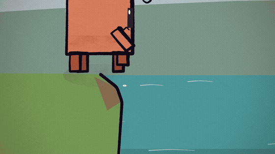
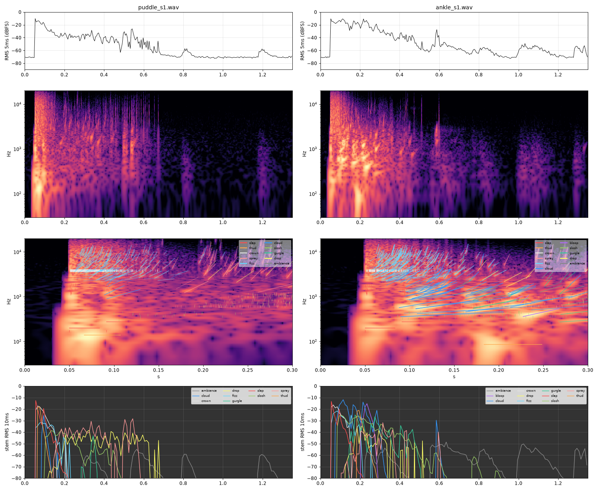
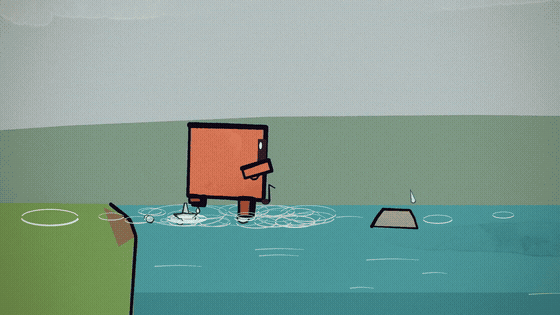
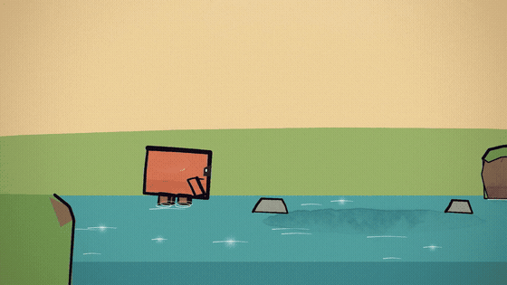
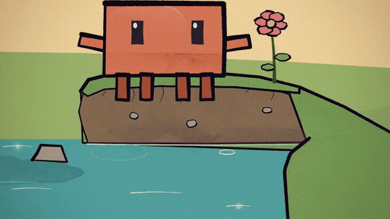
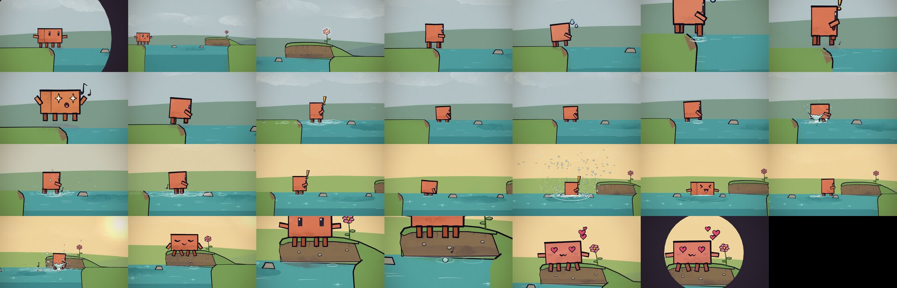
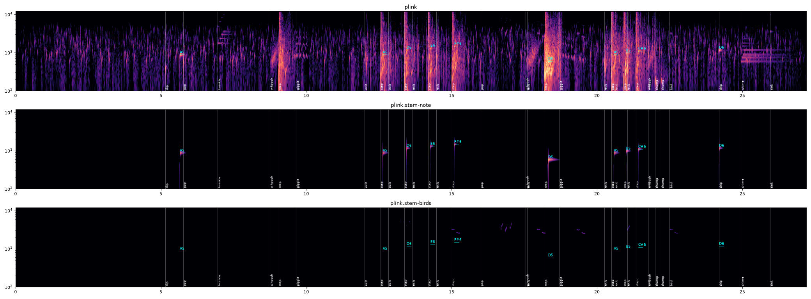

# Plink

**The sound of a foot stepping into water, computed from physics, and a 27-second animated film scored with it.**



▶ **[Watch the film with sound](media/plink_v2.mp4)** (27 s, MP4). The GIFs on this page are silent previews.

No recordings, samples, sound libraries or audio models were used. Every sound in the film is computed by
[`synth/synth.js`](synth/synth.js), a dependency-free JavaScript module, from physical models of what water does when
something touches it: the water, the cartoon sound effects, the birds and the melody. Claude (Anthropic's model,
working in Claude Code) wrote the synth and made the film. Clément Dumas listened and sent feedback. The checks
during development were spectrograms, signal metrics written for the purpose, and Clément's ears. Once, after synth
v7, three audio models were asked blind what they heard ([`NOTES.md`](NOTES.md)). Nothing was changed because of
their answers.

## How water sounds, in code

Most of what you hear when water is disturbed is bubbles. A foot or a drop hitting the surface traps small pockets of
air, and each bubble rings like a tiny bell at the Minnaert frequency, f ≈ 3.26 m/s ÷ r: a bubble 3 mm in radius
rings near 1.1 kHz. The synth builds a step out of these pieces:

- **Bubbles**: damped sine waves whose pitch rises slightly as they near the surface. The damping and the rise
  follow van den Doel, *Physically-based Models for Liquid Sounds* (ACM Transactions on Applied Perception, 2005).
- **The impact**: the slap of the sole, with the air cushion under it, and a thud on the bottom.
- **The splash, as many small splashes**: pockets of air torn into a few bubbles each, blobs of water that land
  with a splat, and droplets flying real ballistic arcs. Each droplet ticks when it lands and sometimes traps a
  bubble of its own.
- **Contact time**: every water-on-water knock is shaped by how long the contact lasts. The attack is about
  radius ÷ speed and the brightness about 2 × speed ÷ radius, so a slow drip is a dull "tup" and only the bubble
  it traps is bright.
- **Lifting the foot out**: water pulled up with the foot, the hole closing, and drips falling back.

`makeStep` turns step parameters (depth, foot speed, how flat the sole lands) into a list of acoustic events.
`makeWalk` chains steps with natural variation, and `render` turns the events into stereo audio. The presets are
`puddle`, `ankle` and `shin`.

## Seven versions

Each version's code, plots and sound files are in [`history/`](history), and [`HISTORY.md`](HISTORY.md) explains
what changed and why. The hardest bug was a crackle Clément heard from v3 onward, "as if some bubble parameter were
so short and there are so many that we hear that". The first fix passed a check that only looked at a single
step, and he still heard it in the six-step walk. The crackle only went away once there was a measurement that
agreed with his ears (treble kurtosis, [`tools/impulsiveness.py`](tools/impulsiveness.py)), and the knocks were
rebuilt from contact physics.

To hear v7, open [`media/steps/`](media/steps): a puddle step, an ankle-deep step, a step in and out, and a wading
walk.

v7, a puddle step and an ankle-deep step: level, spectrogram, the synth's events drawn over the first 0.3 s, and the
level of each component.



## The film

Plink is painted with the p5.js + p5.brush kit from
[ClaudeAnimationBase](https://github.com/JohnHeibel/ClaudeAnimationBase). The picture and the soundtrack come from
the same events:

- **Sync by construction.** The synth exports every audible event (each droplet's launch time, speed and size,
  each bubble, each footfall) to [`animation/src/scenes/plink_score.js`](animation/src/scenes/plink_score.js). The
  scene paints each droplet on its real parabola, so its ring appears on the frame where its tick sounds.
- **One timeline, two readers.** [`animation/story.json`](animation/story.json) holds the shots, the named beats and
  the sound cues. The score script and the scene both read it, so moving a beat moves the picture and the sound
  together.
- **A melody of tuned bubbles.** A bubble of radius r = 3.26/f rings at the note f, so the film's melody is played
  by bubbles: the first plink is the first note, the trot climbs A D E F♯, the jump lands on the low D, the wade-out
  adds A B C♯, and the last drop plays the high D. A small music note pops up at each note, except under the
  jump's big splash.





The whole film, one frame per second:



The soundtrack, with the melody's notes labelled (mix, melody, birds):



[`media/plink_v1.mp4`](media/plink_v1.mp4) is the first cut. Clément's five notes on it led to version 2, which was
made by a supervising Claude instance and four teammates working in parallel, one per part of the film:
[`animation/ROUND2.md`](animation/ROUND2.md). What we learned about the kit is in
[`animation/LESSONS.md`](animation/LESSONS.md).

The same bubbles also play a short tune on their own:
[`media/bubble_etude.wav`](media/bubble_etude.wav) ([`scratch/bubble_etude.mjs`](scratch/bubble_etude.mjs)).

## Run it

You need Node.js 22. The Python analysis tools also need [uv](https://docs.astral.sh/uv/).

```bash
# one step into ankle-deep water, and a six-step walk
node synth/render.mjs --preset ankle --seed 1 --out step.wav
node synth/render.mjs --preset ankle --seed 1 --walk 6 --out walk.wav

# the film's soundtrack and the painter's data, from animation/story.json
node synth/score_plink.mjs

# the film. render.mjs drives headless Chrome: pass --chrome=<path> or set CHROME_PATH if it isn't found
cd animation && npm ci
node render.mjs --gpu-angle=gl-egl --clip --audio=assets/plink.wav --out=out/plink.mp4   # Linux with an NVIDIA GPU
node render.mjs --soft-gl --clip --audio=assets/plink.wav --out=out/plink.mp4            # CPU only: slow
node render.mjs --soft-gl --sheet=5.6,13,18.3,24.2 --out=out/sheet.jpg                    # a few frames
```

[`artifact/sploosh.html`](artifact/sploosh.html) runs the synth in the browser: play each version, and click a
bubble to hear it.

## Credits

- Animation kit: [ClaudeAnimationBase](https://github.com/JohnHeibel/ClaudeAnimationBase) by John Heibel (MIT
  license, kept in [`animation/LICENSE`](animation/LICENSE)). It provides the Clawd character, the p5.brush setup and
  the render script, all modified here.
- [p5.js](https://p5js.org) and [p5.brush](https://github.com/acamposuribe/p5.brush).
- Physics: M. Minnaert (1933) on the resonance of air bubbles; K. van den Doel (2005) on bubble damping and pitch.

The code outside `animation/` is under the MIT license ([`LICENSE`](LICENSE)).
